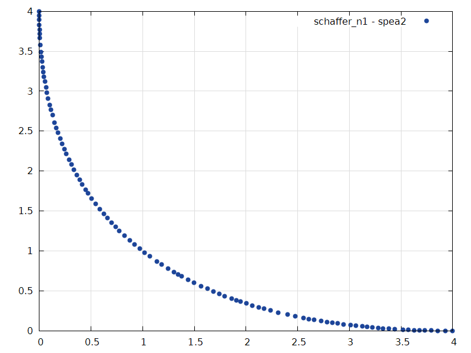

# MOGA

**MOGA** is a Multi-Objective Genetic Algorithm framework for solving a variety
of multi-objective optimization problems. It strives to be simple, performant
and highly focused on usage of closures.

This crate provides you with five genetic operator abstractions that you can
implement and insert into an optimizer - another abstraction, that will run the
common genetic algorithm loop using your operators:

1. **Select** solutions which are suitable for becoming parents of the next
   generation of solutions.
2. **Recombine** selected solutions, creating the next generation of solutions.
3. **Mutate** each solution.
4. **Test** candidate solutions against certain objectives, evaluating fitness
   scores per each objective for a solution.
5. **Terminate** the loop if a certain termination condition is met.

Each operator can be implemented with a closure and optionally parallelized
with [rayon](https://crates.io/crates/rayon) with a single method call.

This crate and each its module features rich [documentation](https://docs.rs/moga).
Read at least some of it. Or jump straight to the [example](#example) and start
writing your own code.

## Features

- Convenient abstractions over genetic operators that are executed by
  optimizers
- Optional and easily achievable parallelization of application of your
  operators backed by famous [rayon](https://crates.io/crates/rayon) crate
- Closures as operators ~~almost~~ everywhere you like
- Highly generic code with absolutely unreadable compiler error messages should
  you make a mistake somewhere
- Not one, not three, but **two** implementations of multiobjective genetic
  algorithms - [NSGA-II] and [SPEA-II]
- Builders with compile time verification from
  [typed-builder](https://crates.io/crates/typed-builder) crate for convenient
  construction of the optimizers
- Everything is documented. Read the [manual](https://docs.rs/moga)!

## Example

Here's a solution for the textbook *Schaffer's Problem No.1* with the [SPEA-II]
optimizer. This solution is oversimplified and very suboptimal, but it
demonstrates the framework's workflow and manages to find Pareto optimal
solutions for that problem.

```rust
use moga::{
  operator::ParBatch,
  optimizer::{spea::Spea2, Optimizer},
  selection::RouletteSelector,
  termination::GenerationTerminator,
};
use rand::Rng;
// initial solutions lie between 0 and 100
let population = (0..100).map(|i| i as f32).collect::<Vec<_>>();
// archive size of `Spea2` optimizer
let archive_size = 100;
// objective functions `f1(x) = x^2` and `f2(x) = (x - 2)^2`
let test = |x: &f32| [x.powf(2.0), (x - 2.0).powf(2.0)];
// a `Selector` that selects 10 random solutions. selection chance of a
// solution is directly proportional to the number of solutions it dominates
let selector = RouletteSelector(10);
// for each pair of parents `x` and `y` create an offspring
// `o = x + r * (y - x)` where `r` is a random value between -1 and 2
let r = || rand::thread_rng().gen_range(-1.0..2.0);
let recombinator = |x: &f32, y: &f32| x + r() * (y - x);
// a `Mutation` that does not mutate solutions
let mutation = |_: &mut f32| {};
// a `Termiantor` that terminates after 100 generations
let terminator = GenerationTerminator(100);
// a builder with compile time verification from `typed-builder` crate
let spea2 = Spea2::builder()
  .population(population)
  .archive_size(archive_size)
  // `test` will be executed concurrently for each batch of solutions
  .tester(test.par_batch())
  .selector(selector)
  .recombinator(recombinator)
  .mutator(mutation)
  .terminator(terminator)
  .build();
// upon termination optimizer returns the best solutions it has found
// or an error should it occur
let solutions = spea2.optimize().unwrap();
```

By calcualting objective functions' values for each solution and plotting them,
we can make sure that found solutions are indeed Pareto optimal:



## Use cases

*This crate was designed to solve a very specific problem which, in case of
success, will certainly appear in this list. If this crate happens to be
useful to you, please contact me, and I'll be happy to put your repo on the
list.*

## Contributions

Contributions are very welcome, be it another genetic algorithm implementation
or an example of some problem solved with **MOGA**. Don't forget to write some
docs and tests, and run *rustfmt* and *clippy* on your code.

## Changelog

[Here you go](./CHANGELOG.md).

## License

This crate is licensed under [MIT](./LICENSE) license.

[NSGA-II]: https://sci2s.ugr.es/sites/default/files/files/Teaching/OtherPostGraduateCourses/Metaheuristicas/Deb_NSGAII.pdf
[SPEA-II]: https://www.research-collection.ethz.ch/bitstream/handle/20.500.11850/145755/eth-24689-01.pdf